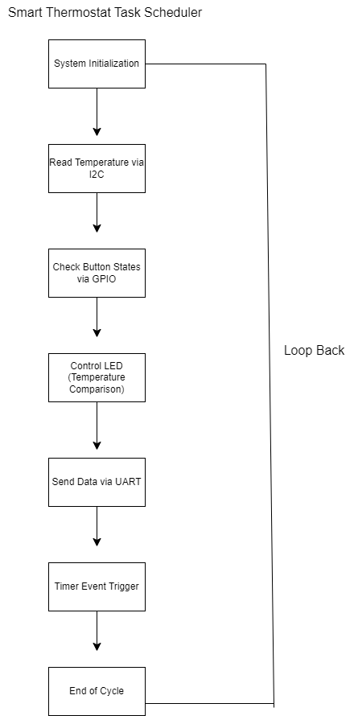

# CS350Final
Embedded Systems

# CS 350 Course Final: Smart Thermostat Project

## Overview

This repository contains the project files for the smart thermostat prototype developed as part of the CS 350 course. The project was conducted to explore emerging systems architectures and technologies, focusing on creating a smart thermostat using the Texas Instruments (TI) CC3220x LaunchPad. The project aimed to read room temperature, control a heating system based on user input, and simulate data transmission to a server. This README provides a detailed reflection on the project, summarizing its objectives, achievements, and areas for improvement.

## Project Artifacts

### 1. Task Scheduler

The task scheduler is designed to manage the operations of the thermostat efficiently, ensuring smooth functionality of temperature sensing, user interaction, and data communication. The scheduler was developed based on the specifications provided in the Project Thermostat Lab Guide.

### 2. Source Code

The source code for this project includes the implementation of temperature sensing via I2C, user interaction through GPIO-controlled buttons, and UART-based data communication to simulate server transmission. The code is well-documented and follows best practices to ensure maintainability and readability.

### 3. Video Demonstration

A video demonstration of the project’s functionality is provided below. The video shows the thermostat in action, including temperature sensing, LED indication, and button interactions.

## Reflection

### Project Summary

The smart thermostat project aimed to create a functional prototype that could be used to regulate room temperature and communicate with a server. The project addressed key functionalities such as reading room temperature using a TMP006 sensor via I2C, controlling an LED based on temperature settings, using buttons for temperature adjustments, and simulating data transmission to SysTec’s servers via UART.

### A. What did you do particularly well?

I excelled in implementing the hardware interfaces and ensuring seamless communication between the components. The use of I2C for temperature sensing and GPIO for user input was particularly effective, and I was able to integrate these components smoothly with the task scheduler to ensure efficient operation. Additionally, the UART implementation for simulating server communication was done with careful attention to detail, ensuring correct data formats and transmission rates.

### B. Where could you improve?

There is room for improvement in optimizing the task scheduler for better performance. While the current implementation meets the basic requirements, further refinement could reduce latency and improve responsiveness, especially under varying load conditions. Additionally, I could enhance error handling mechanisms in the code to make the system more robust against unexpected inputs or hardware failures.

### C. What tools and/or resources are you adding to your support network?

Throughout this project, I have added several tools to my support network, including the Texas Instruments Code Composer Studio for development and debugging, and draw.io for creating state-machine diagrams. I also utilized online resources and communities, such as Texas Instruments' developer forums, to troubleshoot issues and gain insights from other developers working on similar projects.

### D. What skills from this project will be particularly transferable to other projects and/or coursework?

The skills I developed in hardware interface programming, such as using I2C for sensor communication and GPIO for user input, are highly transferable to other embedded systems projects. Additionally, the experience of working with UART for data transmission and understanding its configuration settings will be valuable in any future projects involving serial communication. The ability to write maintainable and adaptable code is another key skill that will benefit my ongoing and future coursework.

### E. How did you make this project maintainable, readable, and adaptable?

To ensure maintainability, I followed best practices in coding, including using descriptive variable names, modularizing code into functions, and adding detailed comments to explain the logic behind each section. The code was also written in a way that allows for easy adaptation; for example, adding new sensors or output devices would require minimal changes due to the modular structure. Additionally, the task scheduler was designed with scalability in mind, allowing for future expansions without significant overhauls to the existing codebase.

## Conclusion

This project provided valuable hands-on experience with embedded systems and hardware interfaces, reinforcing my understanding of how to integrate different components effectively. It also offered insights into the challenges of designing for real-world applications, such as optimizing for performance and ensuring reliability. The skills and knowledge gained from this project will undoubtedly be beneficial in my future endeavors in computer science and software engineering.
